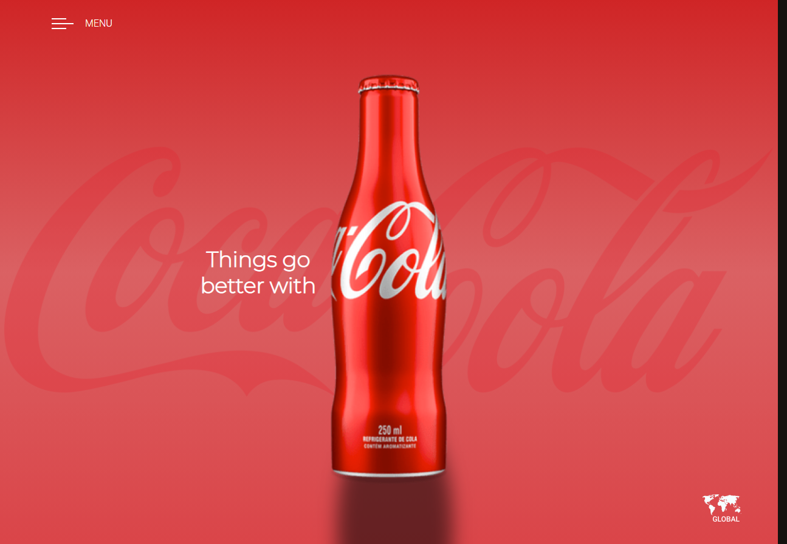

# COCA-COLA- DS2M 🥤

Projeto criado com objetivo didático para as aulas de **PWFE** do curso de Desenvolvimento de Sistemas.

O projeto consiste em criar uma página da **COCA COLA** seguindo as padronizações de um design do Figma,  obtive um bom resultado na inserção dos elementos na página porém com maiores difuculdades com os posicionamentos e responsividade.

